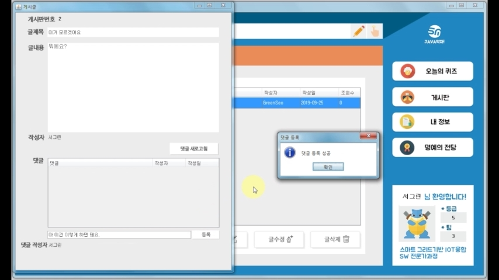

# javaYummy
[스마트그리드기반 IoT융합 SW전문가과정 1차 프로젝트] 스마트미디어 인재개발원 연수생들을 대상으로한, 학습자 중심의 자기 주도적인 학습능력 향상 프로그램 

자바 GUI로 구현한 성적 관리 프로그램 입니다.

팀원 5명이서 9월 23일 ~ 9월 26일 총 4일간 진행하였습니다.

코드 통합 및 내부프레임 방식으로 전체 구조를 설계하고 4개의 메뉴 중 게시판 메뉴를 구현, 공지사항 기능을 구현하였습니다.

